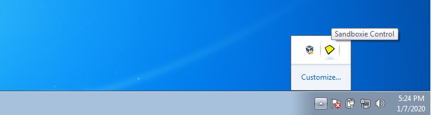
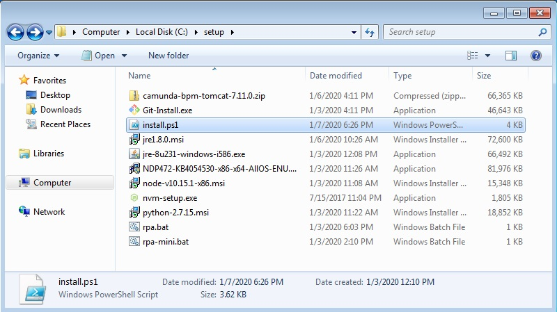
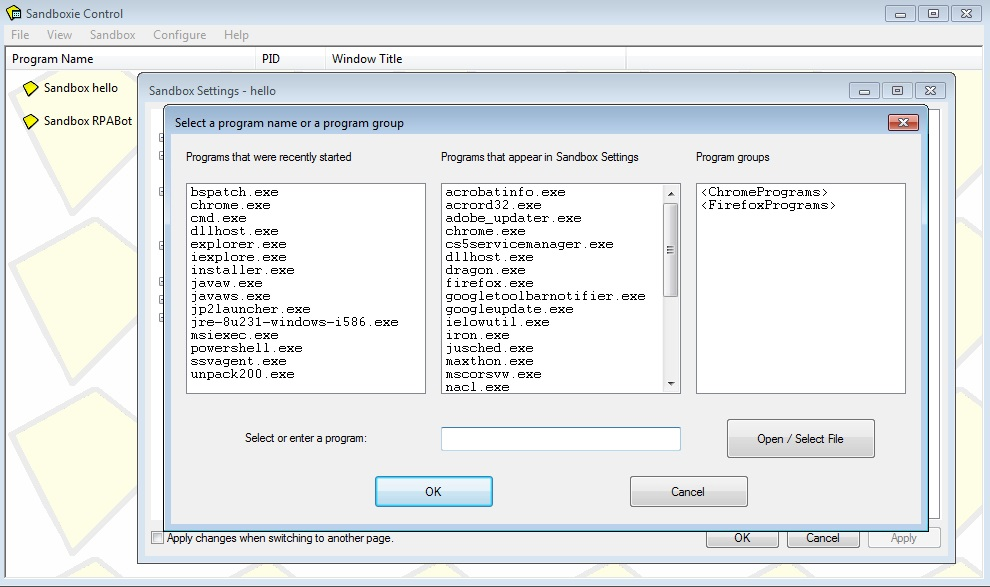

# Sandboxie
sandboxie POC, Findings

### Installing Sandboxie.

You can download the sandboxie from official website [Download Tool](https://www.sandboxie.com/DownloadSandboxie). Install the software in admin mode. It is completely free tool so we use it non-commercial use also. You can see the software availabe at status bar

### Create New Sandbox Environment

Go to Menubar then Sandbox -> Create New Sandbox. Enter the name as you like and click ok button. Then the sandbox name will be available on dashboard.

### Opening any .exe file in sandbox mode

Right click on the sandbox name which you created. then select <Sandbox:name> -> Run Sandboxed -> Run Window Explorer. Then you will see window folder explorer visible on the screen. To confirm wheather it is sandboxed, hover on Title bar of windows explorer you will see a yellow border around the explorer window this shows it is sandboxed.
traverse through explorer and select the exe file and click to execute.

### Opening chrome browser

install the chrome browser in host mission and add the extensions on chrome browser. to open the browser from sandboxie, first it need to be set default then go to Sandboxie, right click on the sandbox name which you created. then select <Sandbox:name> -> Run Sandboxed -> Run Web Browser. Then you will see an sandboxed version of chrome browser.
Every time if you add a new extension in chrome on host system need to restart the sandboxie to get new copy of sandboxed chrome with that extension

Note: If you add any extension on chrome browser during sandboxed, it will not affect host chrome, means it will not be available in host, so once the sandbox is deleted the extension and its data will be removed. 

This will not only for browsers, It will suit for all the application.

### Stoping the sandbox

Right click on the sandbox name which you created. then select <Sandbox:name> -> Terminate Program. This will stop all the application runs on that particular sandbox.

### Clearing/Deleting Sandbox Memory

Even though you terminate the program; sandbox still have the files in hard disk. To clear the file Right click on the sandbox name which you created. then select <Sandbox:name> -> Delete Contents.

### Sandbox Container Folder

to configure or change the sandbox folder Go to Menubar then Sandbox -> Set Container Folder. Change the folder and drive as you like.

### Installing RPA

I created a setup file ([install.ps1](setup/install.ps1)  powershell file) which will install complete rpa with all dependencies except .Net Frameworks and Visual c++ build tool.
.Net Frameworks and Visual c++ build tool need to be install on window host to run window-build-tool, it will not work in sandbox mode.

### Auto start Program

Right click on the sandbox name which you created. then select <Sandbox:name> -> Sandbox settings -> Program Start -> Forced Program, click on add program and select the .bat or .cmd file. [Reference document](https://www.sandboxie.com/ProgramStartSettings)

## Reference Document.

[Forum](https://community.sophos.com/products/sandboxie/f/forum)

[Git Silent installation](https://github.com/git-for-windows/git/wiki/Silent-or-Unattended-Installation)

[JRE Silent installation](http://www.jrsoftware.org/ishelp/index.php?topic=setupcmdline)

[MSI Silent installation](https://www.advancedinstaller.com/user-guide/msiexec.html)

